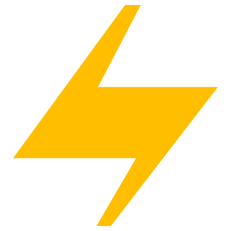
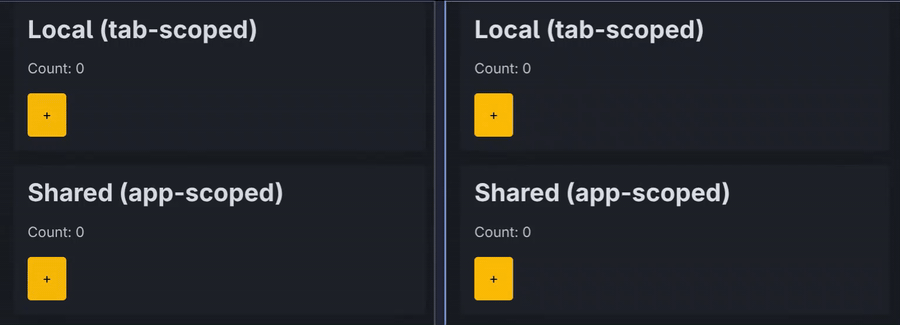

<p align="center">
  <picture>
    <source media="(prefers-color-scheme: dark)" srcset="branding/punch-dark.png">
    
  </picture>
</p>

# Via

[](https://pkg.go.dev/github.com/go-via/via)
[](https://goreportcard.com/report/github.com/go-via/via)
[](https://github.com/go-via/via/actions/workflows/ci.yml)
[](LICENSE)
[](https://go-via.github.io/via)

**Reactive web apps in pure Go.** A composition is a struct, reactive state
is a typed field, actions are methods — and the compiler understands your UI.
Via is the only framework, in any language, that expresses the
**client/server reactive split as a Go type**: `Signal[T]` lives in the
browser, `StateTab/Sess/App[T]` live only on the server. Which side owns a
piece of state is a field declaration the compiler checks, not a convention
you grep for. Transport is SSE only — no WebSockets, no build step, no
hand-written JS.

📖 **[Documentation](https://go-via.github.io/via)** ·
[API reference](https://pkg.go.dev/github.com/go-via/via) ·
[Examples](https://go-via.github.io/via/examples)

## Quickstart: a live chatroom in ~60 lines

`Log` is one app-scoped slice. Appending to it fans a re-render out to
**every connected tab across every session** — open two browsers and watch
them sync. No `Broadcast`, no WebSocket, no client JS.

```go
type Message struct{ From, Body string }

type Room struct {
    Log   via.StateAppSlice[Message] // shared across every session + tab
    Name  via.SignalStr              `via:"name,init=Anon"`
    Draft via.SignalStr              `via:"draft"`
}

func (r *Room) Send(ctx *via.Ctx) {
    body := strings.TrimSpace(r.Draft.Read(ctx))
    if body == "" {
        return
    }
    _ = r.Log.Update(ctx, func(log []Message) ([]Message, error) {
        return append(log, Message{From: r.Name.Read(ctx), Body: body}), nil
    })
    r.Draft.Write(ctx, "")
}

func (r *Room) View(ctx *via.CtxR) h.H {
    // Reading Log here subscribes this tab; any Send anywhere re-renders it.
    return h.Main(h.Class("container"),
        h.H1(h.Text("Via Chat")),
        h.Each(r.Log.Read(ctx), func(m Message) h.H {
            return h.P(h.Strong(h.Text(m.From+": ")), h.Text(m.Body))
        }),
        h.Form(
            h.Input(h.Type("text"), r.Name.Bind(), h.Placeholder("name")),
            h.Input(h.Type("text"), r.Draft.Bind(), on.Key("Enter", r.Send)),
            h.Button(h.Type("button"), h.Text("Send"), on.Click(r.Send)),
        ),
    )
}
```

```bash
go run ./internal/examples/chat   # then open http://localhost:3000 in two windows
```

Full source + walkthrough:
[`internal/examples/chat`](internal/examples/chat/main.go) ·
[tutorial](https://go-via.github.io/via/tutorial).

## Install

```bash
go get github.com/go-via/via
```

## Quickstart: the counter

`Hits` is server-owned; `Step` rides in the browser. `on.Click(c.Inc)` is a
typed method reference — a typo is a compile error.

```go
package main

import (
    "net/http"

    "github.com/go-via/via"
    "github.com/go-via/via/h"
    "github.com/go-via/via/on"
)

type Counter struct {
    Hits via.StateTabNum[int]
    Step via.SignalNum[int] `via:"step,init=1"`
}

func (c *Counter) Inc(ctx *via.Ctx) {
    _ = c.Hits.Update(ctx, func(n int) (int, error) {
        return n + c.Step.Read(ctx), nil
    })
}

func (c *Counter) View(ctx *via.CtxR) h.H {
    return h.Div(
        h.P(h.Text("Count: "), c.Hits.Text(ctx)),
        h.Input(h.Type("number"), c.Step.Bind()),
        h.Button(h.Text("+"), on.Click(c.Inc)),
    )
}

func main() {
    app := via.New()
    via.Mount[Counter](app, "/")
    _ = http.ListenAndServe(":3000", app)
}
```

```bash
go run ./internal/examples/counter
```



## The four reactive shapes

Whether state lives on the client, the server, or both is the field's type:

| Handle             | Scope       | Lives on        |
| ------------------ | ----------- | --------------- |
| `via.Signal[T]`    | per-tab     | client + server |
| `via.StateTab[T]`  | per-tab     | server only     |
| `via.StateSess[T]` | per-session | server only     |
| `via.StateApp[T]`  | global      | server only     |

`Read(ctx)` / `Update(ctx, fn)` everywhere; `Signal` and `StateTab` add
`Write(ctx, v)`. The `Num` / `Bool` / `Str` / `Slice` / `Map` wrappers add
typed `Op(ctx)` verbs (`Add`, `Toggle`, `Append`, …).
[Full model →](https://go-via.github.io/via/reactive-state)

## What Via is — and is not

- **Is:** server-rendered pages with typed end-to-end state, a fine-grained
  reactive client runtime (Datastar / Alien Signals), and no build step —
  best for internal tools, dashboards, and line-of-business apps you'd
  otherwise build with LiveView, Hotwire, or htmx + hand-written JS.
- **Is not** an SPA framework — the browser receives HTML, not a JSON bundle.
- **Is not** a cluster runtime — `StateApp[T]` and `Broadcast` are
  single-process; horizontal scaling needs sticky sessions.
- **Is not** offline-first or stable yet — drop the SSE stream and the tab
  freezes until the client reconnects (Datastar retries automatically), and
  APIs can still shift pre-1.0.

## Documentation

The full guide and reference live at
**[go-via.github.io/via](https://go-via.github.io/via)**.

- [Why Via](https://go-via.github.io/via/why-via) — the thesis, and Via vs.
  LiveView / Hotwire / htmx / templ.
- [Getting started](https://go-via.github.io/via/getting-started) ·
  [Tutorial](https://go-via.github.io/via/tutorial) — install, your first
  composition, then build the live chatroom.
- [Reactive state](https://go-via.github.io/via/reactive-state) — `Signal`
  vs `StateTab/Sess/App`, typed ops, view helpers.
- [Actions & lifecycle](https://go-via.github.io/via/actions-and-lifecycle)
  — events, hooks, streaming, broadcast.
- [Rendering](https://go-via.github.io/via/rendering) ·
  [h helpers](https://go-via.github.io/via/h-helpers) — the HTML DSL.
- [Routing & sessions](https://go-via.github.io/via/routing-sessions-middleware)
  — routing, groups, sessions, auth, the middleware stack.
- [File uploads](https://go-via.github.io/via/file-uploads) — `via.File`.
- [Plugins](https://go-via.github.io/via/plugins) — picocss, echarts.
- [Testing](https://go-via.github.io/via/testing) ·
  [Production & ops](https://go-via.github.io/via/production) — `vt`; config,
  metrics, security, deploys.
- [Examples](https://go-via.github.io/via/examples) ·
  [Troubleshooting](https://go-via.github.io/via/troubleshooting) ·
  [Glossary](https://go-via.github.io/via/glossary).

## License

MIT
