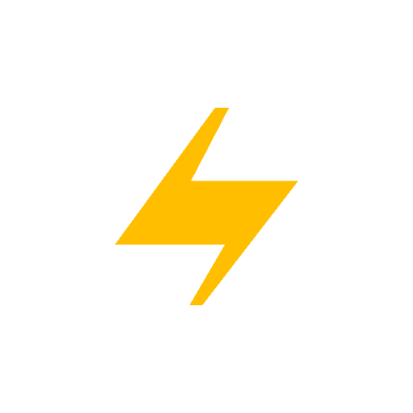

<p align="center">
  
</p>

# via

[](https://pkg.go.dev/github.com/go-via/via)
[](https://github.com/go-via/via/actions/workflows/codeql.yml)
[](https://github.com/go-via/via/actions/workflows/ci.yml)
[](LICENSE)
[](https://go-via.dev)

**Reactive web UIs in pure Go.** A page is a struct, a click is a method
call, and via streams what changed back to the tab. Markup is Go functions,
state is a typed field, and the compiler checks the wiring: `via.On("click",
c.Inc)` takes a method value, so a misspelled handler does not build. No
JavaScript to write, no build step, no WebSockets. A page is a plain request
and response until something on it ticks, listens or displays server state;
then it streams over SSE, per tab.

**[Documentation](https://go-via.dev)** ·
[API reference](https://pkg.go.dev/github.com/go-via/via) ·
[Examples](internal/example/README.md)

## Install

```bash
go get github.com/go-via/via@v0.8.0
```

Requires Go 1.27 or newer. The public API uses generic methods
(`ctx.Param[int]("id")`, `ctx.Session().Get[User]()`); on an older toolchain
those read as ordinary syntax errors, not as a version complaint, so check
`go version` first if the program below will not compile.

## Quickstart: the whole program

```go
package main

import (
	"log"
	"net/http"
	"sync/atomic"

	"github.com/go-via/via"
	"github.com/go-via/via/h"
)

type Counter struct{ n *atomic.Int64 }

func (c *Counter) Inc(ctx *via.Ctx) { c.n.Add(1) }
func (c *Counter) Dec(ctx *via.Ctx) { c.n.Add(-1) }

func (c *Counter) View() h.H {
	return h.Div(
		h.Button(via.On("click", c.Dec), h.Str("-")),
		h.H1(h.Str(c.n.Load())),
		h.Button(via.On("click", c.Inc), h.Str("+")),
	)
}

func main() {
	r := via.Handler(Counter{n: new(atomic.Int64)})
	err := http.ListenAndServe(":8080", r)
	r.Close()
	log.Fatal(err)
}
```

The same program with a mutex-guarded store is
[`internal/example/counter`](internal/example/counter).

A composition is a struct. Its `View` is a pure, `ctx`-free function. Actions
are methods, wired by named method value: no strings, no closures. `Handler`
and `Mount` take the composition by value, so there is no `&` at any call
site, and a missing or mistyped `View` is a compile error. A click POSTs, the
server re-renders, and the page morphs in place.

For a page that pushes, see [`pulse`](internal/example/pulse) (a server tick
over SSE) and [`chat`](internal/example/chat) (a `Topic` fanning every message
out to every connected tab).

## Where state lives

Whether a value lives in the browser, on the server, or is shared by every
tab is the field's type:

| Handle                | Lives on        | Scope                            |
| --------------------- | --------------- | -------------------------------- |
| `via.Signal[T]`       | client + server | per tab, round-trips per action  |
| `via.SignalCS[T]`     | client only     | per tab, never sent              |
| `via.State[T]`        | server          | per connection, pushed on flush  |
| `via.List[E]`         | server          | `State[[]E]` with row verbs      |
| `via.StateTrack(t,…)` | server          | one value, every tab follows     |
| `topic.Topic[T]`      | server          | fan-out to every `ctx.Listen`    |

Rendering a `State` or registering a `Tick`/`Listen` is what makes a page
live; a page that does neither is a plain HTTP round trip.
[Signals →](https://go-via.dev/signals) · [Live →](https://go-via.dev/live)

## The hard guarantees

- **No reflection in your wiring.** Nothing you write is bound by name: no
  tags, no method lookup by string, no struct shape kept in sync with a
  template. via reflects in a few narrow places, none of them on your
  identifiers: a handler's code pointer for its action id, a composition's
  field offsets to name signal slots and find children, and the hook
  signature check at `Mount`.
- **No user-facing identifier strings.** No `via:"name"` tags, no wire keys.
- **No closures at a via call site.** Named method values only.
- **No `any` in element or child signatures.** The `h.H` tree is sealed.
- **Zero `&` at any user call site.** via owns addressing.
- **`View` is pure and `ctx`-free.**
- **Safe by construction.** Output is escaped with no opt-out, only what a
  render bound is dispatchable, and every page carries a derived CSP.

`TestExamples_takeNoAddressOfOrClosureAtViaCallSites` fails the build if an
example violates the `&`/closure rules.

## What via is, and is not

- **Is:** server-rendered pages with typed state, a reactive browser runtime
  (Datastar, which morphs the page in place) and no build step. Best for
  internal tools, dashboards and line-of-business apps you would otherwise
  build with LiveView, Hotwire or htmx plus hand-written JS.
- **Is not** an SPA framework. The browser receives HTML, not a JSON bundle.
- **Is not** a shared-state store. `topic.Topic` is in-process; past one pod
  you bring a bus and sticky sessions. [Deploy →](https://go-via.dev/deploy)
- **Is not** stable yet. APIs can still shift before 1.0.

## Documentation

The guide lives at **[go-via.dev](https://go-via.dev)**.

- [Actions](https://go-via.dev/actions) — clicks and form submits as Go
  methods: `via.On`, `via.OnArg`, `PostForm`, and the morph that answers them.
- [Signals](https://go-via.dev/signals) — client-resident state: `Bind`,
  `Display`, `SignalCS` and the `expr` package.
- [Live](https://go-via.dev/live) — per-tab SSE: `Tick`, `Listen`,
  `StateTrack`, and per-user fan-out keyed by the session id.
- [Islands](https://go-via.dev/islands) — handing a subtree to a JS library.
- [Platform](https://go-via.dev/platform) — `Child`, mount patterns, auth as
  an `OnInit` check, the derived CSP, and the lifecycle hooks.
- [Deploy](https://go-via.dev/deploy) — shutdown order, sessions across a
  restart, sticky load balancing and a cross-pod topic bridge.
- [Reference](https://go-via.dev/reference) — the API in tables.
- [`MIGRATION.md`](./MIGRATION.md) — coming from v0.7.
- [`CHANGELOG.md`](./CHANGELOG.md) — the release-by-release record.

## Develop

```bash
GO='env -u GOROOT /usr/bin/go' ./ci.sh   # fmt + vet + build + test -race
```

See [`CONVENTIONS.md`](./CONVENTIONS.md) for the test and code conventions.

`TestLive_onDisposeContinuesAfterAPanickingDisposer` is known-flaky under
heavy sweeps (`-race -cpu 1 -count=40` and up): a race in the test harness
between `synctest.Wait()` and real network I/O, not a product defect. CI gates
at `-count=1`, which is green.

## License

MIT
